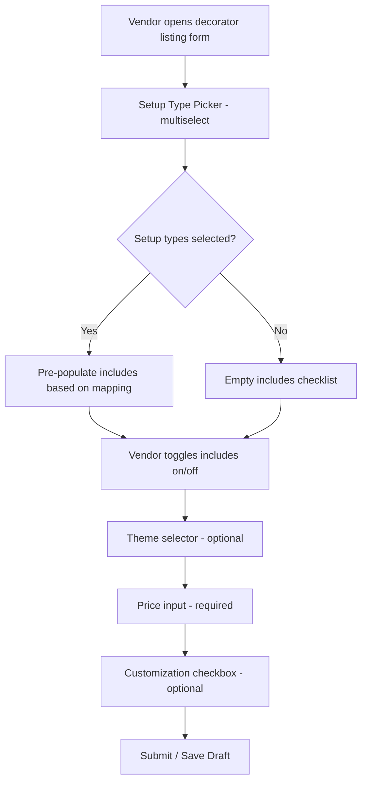

# Design Document: Decorator Form Simplification

## Overview

This design replaces the current 12-field decorator vendor listing form with a streamlined ~5-field form built around a setup-type-based approach. Vendors pick their decoration service type(s), get a smart pre-populated inclusions checklist, set a price, and optionally pick a theme. The implementation stays entirely within the existing `CategoryFieldConfig` system — no new components or database changes needed.

The key insight: the existing `MultiSelectFieldInput` component already supports visual card-style selection and custom options. We reuse it for the new `setupType` field, and wire up the `dependsOn`-style logic to pre-populate the `includes` field based on setup type selection.

## Architecture

The change is scoped to three files:

1. **`categoryFieldConfigs.ts`** — Replace the decorator `FieldSchema[]` with the new 5-field config, add a setup-type-to-inclusions mapping
2. **`listingTemplates.ts`** — Update the 3 decorator templates to use `setupType` instead of `decorType` and remove deleted fields
3. **`CategoryFieldRenderer.tsx`** — Add a small pre-population hook that watches `setupType` changes and updates `includes` defaults

No backend changes. No database migrations. The `categorySpecificData` column stores JSON, so field name changes are transparent to the backend.



## Components and Interfaces

### Setup Type to Inclusions Mapping

A new constant `SETUP_TYPE_DEFAULTS` maps each setup type to its default inclusions:

```typescript
const SETUP_TYPE_DEFAULTS: Record<string, string[]> = {
  'Balloon Decoration': ['Balloons', 'Balloon Arch', 'Helium Balloons', 'Backdrop'],
  'Floral Setup': ['Fresh Flowers', 'Artificial Flowers', 'Flower Arrangements', 'Garlands'],
  'Stage / Mandap': ['Backdrop', 'Drapes & Fabrics', 'Lighting', 'Fresh Flowers', 'Props'],
  'Room Decoration': ['Balloons', 'Lighting', 'Drapes & Fabrics', 'Props', 'Backdrop'],
  'Car Decoration': ['Fresh Flowers', 'Artificial Flowers', 'Ribbons'],
  'Entrance & Pathway': ['Entrance Arch', 'Lighting', 'Fresh Flowers', 'Props'],
  'Table Setting': ['Table Centerpieces', 'Candles', 'Runners & Linens', 'Props'],
  'Ceiling & Draping': ['Ceiling Decoration', 'Drapes & Fabrics', 'Lighting', 'Chandeliers'],
};
```

This mapping lives in `categoryFieldConfigs.ts` alongside the decorator config.

### Legacy Field Mapping

A constant `LEGACY_DECOR_TYPE_MAP` maps old `decorType` values to new `setupType` values for backward compatibility:

```typescript
const LEGACY_DECOR_TYPE_MAP: Record<string, string> = {
  'Stage Decoration': 'Stage / Mandap',
  'Entrance Decoration': 'Entrance & Pathway',
  'Full Venue Decoration': 'Room Decoration',
  'Mandap Decoration': 'Stage / Mandap',
  'Photo Booth': 'Room Decoration',
  'Ceiling Draping': 'Ceiling & Draping',
  'Table Centerpieces': 'Table Setting',
  'Aisle Decoration': 'Entrance & Pathway',
};
```

### Legacy Checkbox to Includes Mapping

Maps old individual checkbox fields to `includes` values:

```typescript
const LEGACY_CHECKBOX_TO_INCLUDES: Record<string, string> = {
  'stageBackdrop': 'Backdrop',
  'entranceArch': 'Entrance Arch',
  'ceilingDraping': 'Ceiling Decoration',
  'aisleDecoration': 'Aisle Decoration',
};
```

### Updated Decorator Field Config

```typescript
'decorator': {
  categoryId: 'decorator',
  pricingModel: 'per_setup',
  showPackageDetails: true,
  fields: [
    {
      name: 'setupType',
      label: 'Setup Type',
      type: 'multiselect',
      required: true,
      options: [
        'Balloon Decoration', 'Floral Setup', 'Stage / Mandap',
        'Room Decoration', 'Car Decoration', 'Entrance & Pathway',
        'Table Setting', 'Ceiling & Draping'
      ],
      placeholder: 'e.g., Mehendi Setup, Haldi Decoration',
      helpText: 'Pick the type(s) of decoration you offer in this listing',
      fullWidth: true
    },
    {
      name: 'includes',
      label: "What's Included",
      type: 'multiselect',
      required: true,
      options: [
        'Fresh Flowers', 'Artificial Flowers', 'Balloons', 'Balloon Arch',
        'Helium Balloons', 'Drapes & Fabrics', 'Lighting', 'Props',
        'Furniture', 'Backdrop', 'Entrance Arch', 'Ceiling Decoration',
        'Table Centerpieces', 'Candles', 'Runners & Linens', 'Chandeliers',
        'Garlands', 'Flower Arrangements', 'Ribbons', 'Aisle Decoration',
        'Dismantling'
      ],
      placeholder: 'e.g., LED Name Board, Floral Chandelier',
      helpText: 'Pre-filled based on your setup type. Toggle items or add custom ones.',
      fullWidth: true
    },
    {
      name: 'theme',
      label: 'Theme Style',
      type: 'select',
      required: false,
      options: [
        'Traditional', 'Modern', 'Floral', 'Minimalist', 'Royal',
        'Rustic', 'Beach', 'Vintage', 'Contemporary', 'Custom'
      ]
    },
    {
      name: 'price',
      label: 'Price (₹)',
      type: 'number',
      required: true,
      unit: '₹',
      min: 1000,
      helpText: 'Your base price for this décor setup',
      fullWidth: false
    },
    {
      name: 'customizationAvailable',
      label: 'Customization Available',
      type: 'checkbox',
      required: false,
      helpText: 'Can customers request custom designs?'
    }
  ]
}
```

### Pre-Population Logic in CategoryFieldRenderer

The `CategoryFieldRenderer` needs a small addition: when the `setupType` value changes for a decorator listing, compute the merged default inclusions and update the `includes` field.

```typescript
// Inside CategoryFieldRenderer, after handleFieldChange:
const handleDecoratorSetupTypeChange = useCallback((fieldName: string, value: any) => {
  if (categoryId !== 'decorator' || fieldName !== 'setupType') {
    handleFieldChange(fieldName, value);
    return;
  }

  const selectedTypes: string[] = Array.isArray(value) ? value : [];
  const previousTypes: string[] = Array.isArray(values.setupType) ? values.setupType : [];
  const currentIncludes: string[] = Array.isArray(values.includes) ? values.includes : [];

  // Compute defaults for previous and new selections
  const previousDefaults = new Set(
    previousTypes.flatMap(t => SETUP_TYPE_DEFAULTS[t] || [])
  );
  const newDefaults = new Set(
    selectedTypes.flatMap(t => SETUP_TYPE_DEFAULTS[t] || [])
  );

  // Items manually added by vendor (not from any default set)
  const manualItems = currentIncludes.filter(item => !previousDefaults.has(item));

  // Merge: new defaults + manual items, deduplicated
  const mergedIncludes = [...new Set([...newDefaults, ...manualItems])];

  onChange((prev: Record<string, any>) => ({
    ...prev,
    setupType: selectedTypes,
    includes: mergedIncludes,
  }));
}, [categoryId, values, onChange, handleFieldChange]);
```

The renderer passes `handleDecoratorSetupTypeChange` instead of `handleFieldChange` for the `setupType` field only.

### Legacy Data Migration (On Load)

In `ListingPreview.tsx` where `categorySpecificData` is parsed from JSON, add a migration function:

```typescript
function migrateDecoratorData(data: Record<string, any>): Record<string, any> {
  if (data.setupType) return data; // Already migrated

  const migrated = { ...data };

  // Map decorType → setupType
  if (data.decorType) {
    const mapped = (data.decorType as string[]).map(
      dt => LEGACY_DECOR_TYPE_MAP[dt] || dt
    );
    migrated.setupType = [...new Set(mapped)];
    delete migrated.decorType;
  }

  // Merge legacy checkboxes into includes
  const includes: string[] = Array.isArray(data.includes) ? [...data.includes] : [];
  for (const [checkbox, includeValue] of Object.entries(LEGACY_CHECKBOX_TO_INCLUDES)) {
    if (data[checkbox] === true && !includes.includes(includeValue)) {
      includes.push(includeValue);
    }
    delete migrated[checkbox];
  }

  // Add dismantling to includes if it was checked
  if (data.dismantlingIncluded === true && !includes.includes('Dismantling')) {
    includes.push('Dismantling');
  }
  delete migrated.dismantlingIncluded;

  migrated.includes = includes;

  // Keep coverageArea and tableCenterpieces in data but don't display
  // (they stay in the JSON, just no field renders them)

  return migrated;
}
```

This function is called when loading decorator listings for editing.

## Data Models

### Field Config Changes

| Old Field | New Field | Migration |
|-----------|-----------|-----------|
| `decorType` (multiselect) | `setupType` (multiselect) | Map values via `LEGACY_DECOR_TYPE_MAP` |
| `includes` (multiselect) | `includes` (multiselect) | Merge legacy checkbox values in |
| `theme` (select) | `theme` (select) | No change |
| `price` (number) | `price` (number) | No change |
| `customizationAvailable` (checkbox) | `customizationAvailable` (checkbox) | No change |
| `coverageArea` (number) | *removed from form* | Preserved in JSON, not displayed |
| `tableCenterpieces` (number) | *removed from form* | Preserved in JSON, not displayed |
| `stageBackdrop` (checkbox) | *merged into includes* | `true` → add "Backdrop" to includes |
| `entranceArch` (checkbox) | *merged into includes* | `true` → add "Entrance Arch" to includes |
| `ceilingDraping` (checkbox) | *merged into includes* | `true` → add "Ceiling Decoration" to includes |
| `aisleDecoration` (checkbox) | *merged into includes* | `true` → add "Aisle Decoration" to includes |
| `dismantlingIncluded` (checkbox) | *merged into includes* | `true` → add "Dismantling" to includes |

### Listing Template Data Changes

Each decorator template's `categorySpecificData` changes from:

```typescript
{
  price: undefined,
  decorType: ['Stage Decoration', 'Photo Booth'],
  theme: 'Traditional',
  coverageArea: 500,
  tableCenterpieces: 0,
  includes: ['Fresh Flowers', 'Drapes & Fabrics', 'Lighting', 'Backdrop', 'Props'],
  stageBackdrop: true,
  entranceArch: false,
  // ...
}
```

To:

```typescript
{
  price: undefined,
  setupType: ['Stage / Mandap'],
  theme: 'Traditional',
  includes: ['Fresh Flowers', 'Drapes & Fabrics', 'Lighting', 'Backdrop', 'Props'],
  customizationAvailable: true,
}
```


## Correctness Properties

*A property is a characteristic or behavior that should hold true across all valid executions of a system — essentially, a formal statement about what the system should do. Properties serve as the bridge between human-readable specifications and machine-verifiable correctness guarantees.*

### Property 1: Setup type selection produces correct merged includes

*For any* non-empty subset of setup types selected from the available options, the resulting `includes` array should equal the union of all default inclusion items for those setup types, with no duplicates.

More precisely: given `selectedTypes ⊆ SETUP_TYPE_OPTIONS` where `|selectedTypes| ≥ 1`, the resulting includes should satisfy:
- `includes ⊇ ∪{SETUP_TYPE_DEFAULTS[t] | t ∈ selectedTypes}` (all defaults present)
- No duplicate entries in `includes`
- `|includes| = |Set(includes)|` (uniqueness)

**Validates: Requirements 3.1, 3.2**

### Property 2: Setup type deselection preserves manual items and shared defaults

*For any* set of selected setup types, any set of manually added items, and any single setup type that is deselected, the resulting `includes` array should:
- Contain all manually added items
- Contain all default items that belong to at least one still-selected setup type
- Not contain default items that were unique to the deselected setup type (unless manually added)

**Validates: Requirements 3.3**

### Property 3: Legacy data migration correctness

*For any* valid legacy decorator `categorySpecificData` object (containing `decorType`, legacy checkbox fields, `includes`, and optional `coverageArea`/`tableCenterpieces`), applying the migration function should produce an object where:
- `setupType` contains the correctly mapped values from `decorType` via `LEGACY_DECOR_TYPE_MAP`, deduplicated
- `includes` contains the original includes plus any items corresponding to `true` legacy checkboxes, deduplicated
- `coverageArea` and `tableCenterpieces` values are preserved unchanged if they existed
- No legacy checkbox field names (`stageBackdrop`, `entranceArch`, `ceilingDraping`, `aisleDecoration`, `dismantlingIncluded`) remain as top-level keys
- The legacy `decorType` key is removed

**Validates: Requirements 5.1, 5.2, 5.4**

## Error Handling

| Scenario | Handling |
|----------|----------|
| Vendor submits form with no setup type selected | Form validation prevents submission; `setupType` is `required: true` |
| Legacy listing has unknown `decorType` value | `LEGACY_DECOR_TYPE_MAP` falls back to using the original value as-is (pass-through) |
| Legacy listing has no `categorySpecificData` | Migration function returns empty object; form renders with blank fields |
| `includes` field receives duplicate entries from multiple setup types | Set-based deduplication in the pre-population logic ensures uniqueness |
| Vendor manually removes all pre-populated includes | Allowed — `includes` is required but can be any non-empty selection |
| Template selected after manual edits | Template data overwrites current values (existing behavior) |

## Testing Strategy

### Unit Tests

Unit tests cover the static configuration and specific examples:

- Decorator config has exactly 5 fields in the correct order
- Removed fields (`coverageArea`, `tableCenterpieces`, `stageBackdrop`, `entranceArch`, `ceilingDraping`, `aisleDecoration`) are absent from config
- `setupType` field has correct options list
- `showPackageDetails` is `true`
- Each decorator listing template uses `setupType` instead of `decorType`
- Templates don't reference removed fields
- Migration function handles edge case: already-migrated data (has `setupType`) returns unchanged
- Migration function handles edge case: empty/null `categorySpecificData`

### Property-Based Tests

Property tests use a PBT library (e.g., `fast-check` for TypeScript) with minimum 100 iterations each:

- **Feature: decorator-form-simplification, Property 1: Setup type selection produces correct merged includes**
  - Generate random non-empty subsets of setup type options
  - Compute expected includes as union of defaults
  - Assert result matches expected union with no duplicates

- **Feature: decorator-form-simplification, Property 2: Setup type deselection preserves manual items and shared defaults**
  - Generate random selected types, random manual items, random type to deselect
  - Apply selection, add manual items, then deselect one type
  - Assert manual items preserved, shared defaults preserved, unique defaults removed

- **Feature: decorator-form-simplification, Property 3: Legacy data migration correctness**
  - Generate random legacy decorator data (random decorType arrays, random checkbox states, random includes, random coverageArea/tableCenterpieces)
  - Apply migration function
  - Assert all migration invariants hold (correct mapping, merging, preservation, cleanup)

Each property test must be tagged with a comment referencing the design property:
```typescript
// Feature: decorator-form-simplification, Property 1: Setup type selection produces correct merged includes
```
