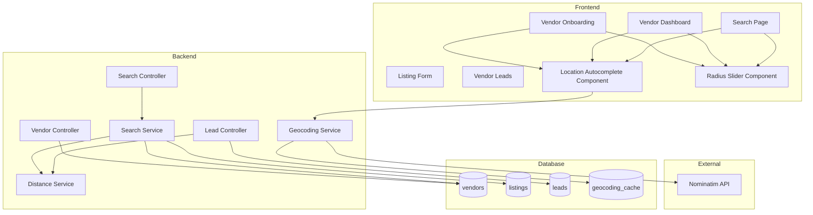

# Design Document: Phase 1 Location System

## Overview

This document describes the technical design for the Phase 1 Location System for EventHub Connect. The system enables location-based matching between vendors and customers using free geocoding services (Nominatim/OpenStreetMap) and bidirectional distance filtering.

The design prioritizes simplicity, zero API costs, and seamless integration with the existing codebase. Key components include:
- Database schema extensions for location data
- Geocoding service integration with caching
- Haversine distance calculation utility
- Updated search and matching logic
- UI components for location input and display

## Architecture



## Components and Interfaces

### 1. Database Schema Extensions

#### Vendors Table Updates
```sql
ALTER TABLE vendors ADD COLUMN IF NOT EXISTS location_name VARCHAR(255);
ALTER TABLE vendors ADD COLUMN IF NOT EXISTS location_lat DECIMAL(10, 8);
ALTER TABLE vendors ADD COLUMN IF NOT EXISTS location_lng DECIMAL(11, 8);
ALTER TABLE vendors ADD COLUMN IF NOT EXISTS service_radius_km INTEGER DEFAULT 25;
```

#### Listings Table Updates
```sql
ALTER TABLE listings ADD COLUMN IF NOT EXISTS service_mode VARCHAR(20) DEFAULT 'BOTH' 
    CHECK (service_mode IN ('CUSTOMER_VISITS', 'VENDOR_TRAVELS', 'BOTH'));
```

#### Leads Table Updates
```sql
ALTER TABLE leads ADD COLUMN IF NOT EXISTS customer_location_name VARCHAR(255);
ALTER TABLE leads ADD COLUMN IF NOT EXISTS customer_location_lat DECIMAL(10, 8);
ALTER TABLE leads ADD COLUMN IF NOT EXISTS customer_location_lng DECIMAL(11, 8);
ALTER TABLE leads ADD COLUMN IF NOT EXISTS distance_km DECIMAL(6, 2);
```

#### Geocoding Cache Table
```sql
CREATE TABLE IF NOT EXISTS geocoding_cache (
    id UUID PRIMARY KEY DEFAULT uuid_generate_v4(),
    query_text VARCHAR(500) NOT NULL,
    location_name VARCHAR(255) NOT NULL,
    latitude DECIMAL(10, 8) NOT NULL,
    longitude DECIMAL(11, 8) NOT NULL,
    created_at TIMESTAMP DEFAULT NOW(),
    expires_at TIMESTAMP DEFAULT NOW() + INTERVAL '30 days',
    UNIQUE(query_text)
);

CREATE INDEX idx_geocoding_cache_query ON geocoding_cache(query_text);
CREATE INDEX idx_geocoding_cache_expires ON geocoding_cache(expires_at);
```

### 2. Backend Services

#### GeocodingService.java
```java
@Service
public class GeocodingService {
    private static final String NOMINATIM_BASE_URL = "https://nominatim.openstreetmap.org";
    private final RestTemplate restTemplate;
    private final GeocodingCacheRepository cacheRepository;
    
    // Autocomplete search - returns list of location suggestions
    public List<LocationSuggestion> autocomplete(String query, int limit);
    
    // Geocode a specific location - returns coordinates
    public GeocodingResult geocode(String locationText);
    
    // Reverse geocode - get location name from coordinates
    public String reverseGeocode(double lat, double lng);
    
    // Check cache before API call
    private Optional<GeocodingResult> checkCache(String query);
    
    // Store result in cache
    private void cacheResult(String query, GeocodingResult result);
}
```

#### DistanceService.java
```java
@Service
public class DistanceService {
    private static final double EARTH_RADIUS_KM = 6371.0;
    
    // Calculate distance using Haversine formula
    public double calculateDistance(double lat1, double lng1, double lat2, double lng2);
    
    // Check if two points are within a given radius
    public boolean isWithinRadius(double lat1, double lng1, double lat2, double lng2, double radiusKm);
    
    // Bidirectional check - both parties must be within each other's radius
    public boolean isBidirectionalMatch(
        double vendorLat, double vendorLng, double vendorRadiusKm,
        double customerLat, double customerLng, double customerRadiusKm
    );
}
```

#### SearchService Updates
```java
// Add location-based filtering to existing search methods
public List<Listing> searchListings(
    Integer eventTypeId,
    String categoryId,
    Listing.ListingType listingType,
    String cityName,
    BigDecimal minPrice,
    BigDecimal maxPrice,
    String searchQuery,
    String eventDate,
    String sortBy,
    Integer limit,
    Integer offset,
    // New location parameters
    Double customerLat,
    Double customerLng,
    Integer searchRadiusKm
);

// Filter vendors by bidirectional distance matching
private List<Vendor> filterByLocation(
    List<Vendor> vendors,
    double customerLat,
    double customerLng,
    int customerSearchRadiusKm
);
```

### 3. DTOs and Request/Response Objects

#### LocationDTO.java
```java
@Data
public class LocationDTO {
    private String name;           // Human-readable location name
    private Double latitude;
    private Double longitude;
}
```

#### LocationSuggestion.java
```java
@Data
public class LocationSuggestion {
    private String displayName;    // Full display name with context
    private String shortName;      // Short area name
    private Double latitude;
    private Double longitude;
}
```

#### VendorLocationUpdateRequest.java
```java
@Data
public class VendorLocationUpdateRequest {
    @NotBlank
    private String locationName;
    @NotNull
    private Double latitude;
    @NotNull
    private Double longitude;
    @Min(10) @Max(100)
    private Integer serviceRadiusKm;
}
```

#### SearchRequestDTO Updates
```java
@Data
public class SearchRequestDTO {
    // Existing fields...
    
    // New location fields
    private Double customerLat;
    private Double customerLng;
    private Integer searchRadiusKm;  // Default: 20
}
```

#### VendorDTO Updates
```java
@Data
public class VendorDTO {
    // Existing fields...
    
    // New location fields
    private String locationName;
    private Integer serviceRadiusKm;
    private Double distanceKm;       // Calculated distance from customer (for search results)
}
```

#### ListingDTO Updates
```java
@Data
public class ListingDTO {
    // Existing fields...
    
    // New field
    private String serviceMode;      // CUSTOMER_VISITS, VENDOR_TRAVELS, BOTH
    private String serviceModeLabel; // Human-readable label
}
```

### 4. Frontend Components

#### LocationAutocomplete.tsx
```typescript
interface LocationAutocompleteProps {
    value: LocationDTO | null;
    onChange: (location: LocationDTO | null) => void;
    placeholder?: string;
    required?: boolean;
    className?: string;
}

// Features:
// - Debounced input (300ms)
// - Dropdown with suggestions
// - Loading state
// - Error handling
// - Clear button
```

#### RadiusSlider.tsx
```typescript
interface RadiusSliderProps {
    value: number;
    onChange: (radius: number) => void;
    options: number[];  // e.g., [10, 25, 50, 100] for vendors
    label?: string;
    className?: string;
}

// Features:
// - Visual slider with tick marks
// - Current value display
// - Accessible labels
```

#### ServiceModeSelector.tsx
```typescript
interface ServiceModeSelectorProps {
    value: ServiceMode;
    onChange: (mode: ServiceMode) => void;
    className?: string;
}

type ServiceMode = 'CUSTOMER_VISITS' | 'VENDOR_TRAVELS' | 'BOTH';

// Features:
// - Radio button group or segmented control
// - Icons for each mode
// - Descriptive labels
```

### 5. API Endpoints

#### Geocoding Endpoints
```
GET /api/public/geocoding/autocomplete?q={query}&limit={limit}
Response: { success: true, data: LocationSuggestion[] }

GET /api/public/geocoding/geocode?q={query}
Response: { success: true, data: GeocodingResult }
```

#### Vendor Location Endpoints
```
PUT /api/vendor/location
Request: VendorLocationUpdateRequest
Response: { success: true, data: VendorDTO }

GET /api/vendor/location
Response: { success: true, data: { locationName, latitude, longitude, serviceRadiusKm } }
```

#### Search Endpoint Updates
```
GET /api/public/search/listings
Additional params: customerLat, customerLng, searchRadiusKm
Response includes: distanceKm for each result

GET /api/public/search/vendors
Additional params: customerLat, customerLng, searchRadiusKm
Response includes: distanceKm for each result
```

## Data Models

### Vendor Entity Updates
```java
@Entity
@Table(name = "vendors")
public class Vendor {
    // Existing fields...
    
    @Column(name = "location_name", length = 255)
    private String locationName;
    
    @Column(name = "location_lat", precision = 10, scale = 8)
    private BigDecimal locationLat;
    
    @Column(name = "location_lng", precision = 11, scale = 8)
    private BigDecimal locationLng;
    
    @Column(name = "service_radius_km")
    private Integer serviceRadiusKm = 25;
}
```

### Listing Entity Updates
```java
@Entity
@Table(name = "listings")
public class Listing {
    // Existing fields...
    
    @Enumerated(EnumType.STRING)
    @Column(name = "service_mode", length = 20)
    private ServiceMode serviceMode = ServiceMode.BOTH;
    
    public enum ServiceMode {
        CUSTOMER_VISITS,
        VENDOR_TRAVELS,
        BOTH
    }
}
```

### Lead Entity Updates
```java
@Entity
@Table(name = "leads")
public class Lead {
    // Existing fields...
    
    @Column(name = "customer_location_name", length = 255)
    private String customerLocationName;
    
    @Column(name = "customer_location_lat", precision = 10, scale = 8)
    private BigDecimal customerLocationLat;
    
    @Column(name = "customer_location_lng", precision = 11, scale = 8)
    private BigDecimal customerLocationLng;
    
    @Column(name = "distance_km", precision = 6, scale = 2)
    private BigDecimal distanceKm;
}
```

### GeocodingCache Entity
```java
@Entity
@Table(name = "geocoding_cache")
public class GeocodingCache {
    @Id
    @GeneratedValue(strategy = GenerationType.UUID)
    private UUID id;
    
    @Column(name = "query_text", nullable = false, unique = true, length = 500)
    private String queryText;
    
    @Column(name = "location_name", nullable = false, length = 255)
    private String locationName;
    
    @Column(nullable = false, precision = 10, scale = 8)
    private BigDecimal latitude;
    
    @Column(nullable = false, precision = 11, scale = 8)
    private BigDecimal longitude;
    
    @Column(name = "created_at")
    private LocalDateTime createdAt;
    
    @Column(name = "expires_at")
    private LocalDateTime expiresAt;
}
```

## Correctness Properties

*A property is a characteristic or behavior that should hold true across all valid executions of a system—essentially, a formal statement about what the system should do. Properties serve as the bridge between human-readable specifications and machine-verifiable correctness guarantees.*

### Property 1: Location Data Round-Trip Consistency
*For any* valid location (name, latitude, longitude), storing it in the database and then retrieving it SHALL produce an equivalent location object with the same coordinates (within floating-point precision tolerance of 0.000001 degrees).
**Validates: Requirements 1.3, 3.2, 5.3**

### Property 2: Haversine Distance Calculation Accuracy
*For any* two valid coordinate pairs (lat1, lng1) and (lat2, lng2), the calculated Haversine distance SHALL be within 1% of the actual great-circle distance, and the distance SHALL always be non-negative.
**Validates: Requirements 7.3**

### Property 3: Bidirectional Matching Symmetry
*For any* vendor with location (vLat, vLng, vRadius) and customer with location (cLat, cLng, cRadius), the vendor is visible to the customer IF AND ONLY IF:
- distance(vLat, vLng, cLat, cLng) <= cRadius AND
- distance(vLat, vLng, cLat, cLng) <= vRadius
**Validates: Requirements 7.2, 7.4, 7.5**

### Property 4: Search Radius Filtering Correctness
*For any* search with customer location and radius, ALL returned vendors SHALL have a calculated distance less than or equal to the customer's search radius, AND all returned vendors SHALL have the customer within their service radius.
**Validates: Requirements 6.3, 6.5**

### Property 5: Distance Display Formatting
*For any* calculated distance value, the formatted display string SHALL contain a whole number followed by " km" (e.g., "7 km", "15 km"), and the whole number SHALL be the rounded value of the actual distance.
**Validates: Requirements 8.5**

### Property 6: Radius Expansion Logic
*For any* current radius value from the predefined options [5, 10, 20, 30, 50], expanding the radius SHALL produce the next value in the sequence, except when at maximum (50) where it SHALL remain at 50.
**Validates: Requirements 10.3**

### Property 7: Geocoding Cache Effectiveness
*For any* geocoding query that has been previously executed and cached, subsequent identical queries SHALL return results from cache without making an external API call, and the cached result SHALL be equivalent to the original result.
**Validates: Requirements 11.4**

### Property 8: Single-Value Location Constraints
*For any* vendor, there SHALL be exactly one primary location stored at any time. Updating the location SHALL replace the previous location, not add to it.
**Validates: Requirements 12.1, 12.3**

### Property 9: Service Mode Persistence
*For any* listing with a selected service mode, saving and retrieving the listing SHALL preserve the exact service mode value (CUSTOMER_VISITS, VENDOR_TRAVELS, or BOTH).
**Validates: Requirements 4.3**

### Property 10: Lead Location Information Completeness
*For any* lead created with customer location data, the lead display SHALL include the customer area name, calculated distance from vendor, and service mode—all derived from the stored location coordinates.
**Validates: Requirements 9.1, 9.2, 9.4**

## Error Handling

### Geocoding Service Errors
1. **API Unavailable**: Display user-friendly error message, allow manual retry, log error for monitoring
2. **Rate Limiting**: Implement exponential backoff, use cached results when available
3. **Invalid Response**: Validate response structure, fall back to error state
4. **No Results Found**: Display "Location not found" message, suggest alternative input

### Location Validation Errors
1. **Missing Location**: Block form submission, highlight required field
2. **Invalid Coordinates**: Validate latitude (-90 to 90) and longitude (-180 to 180)
3. **Missing Radius**: Use default value (25 km for vendors, 20 km for customers)

### Distance Calculation Errors
1. **Missing Coordinates**: Exclude vendor from results, log warning
2. **Invalid Coordinates**: Skip distance calculation, exclude from location-filtered results

## Testing Strategy

### Unit Tests
- Haversine distance calculation with known coordinate pairs
- Bidirectional matching logic with edge cases
- Distance formatting function
- Radius expansion logic
- Location validation

### Property-Based Tests
Using a property-based testing library (e.g., jqwik for Java, fast-check for TypeScript):

1. **Distance Calculation Properties**: Generate random coordinate pairs, verify non-negative distances, verify symmetry (distance A→B = distance B→A)
2. **Bidirectional Matching Properties**: Generate random vendor/customer pairs, verify matching logic consistency
3. **Round-Trip Properties**: Generate random locations, verify storage and retrieval consistency
4. **Formatting Properties**: Generate random distances, verify output format

### Integration Tests
- Geocoding API integration with caching
- Search endpoint with location filtering
- Vendor onboarding with location data
- Lead creation with location capture

### End-to-End Tests
- Complete vendor onboarding flow with location
- Customer search with location and radius
- Lead display with location information
